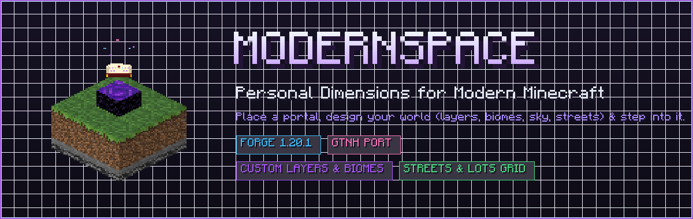
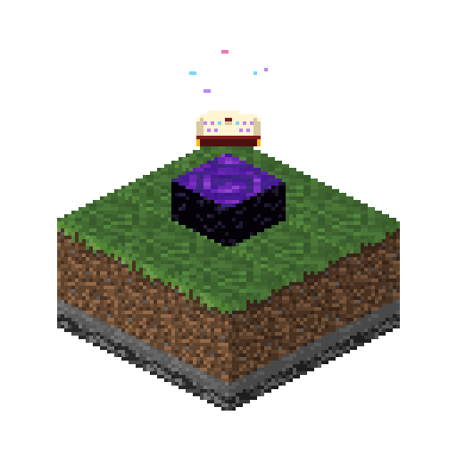

<div align="center">
  
  <br><br>
  
  <h1>ModernSpace</h1>
  <p><strong>Personal pocket dimensions for modern Minecraft (Forge 1.20.1)</strong></p>

  <p>
    <a href="https://github.com/Raishxn/ModernSpace/releases"></a>
    
    
    <a href="https://www.curseforge.com/minecraft/mc-mods/infiniverse"></a>
    <a href="LICENSE"></a>
  </p>
</div>

---

**ModernSpace** is a dedicated Forge 1.20.1 port and modern remaster of **[PersonalSpace](https://github.com/GTNewHorizons/PersonalSpace)** from *GregTech: New Horizons*.

Craft and place a portal, launch the in-game world editor to tailor your own private realm—custom block layers, biomes, sky colors, clouds, weather, daylight cycles, streets and building lots—and step right through into an isolated, lag-free dimension.

---

## Table of Contents

- [Why ModernSpace?](#why-modernspace)
- [Key Features](#key-features)
  - [Personal Space Portal](#personal-space-portal)
  - [Interactive World Editor](#interactive-world-editor)
  - [Urban Planning: Streets & Lots](#urban-planning-streets--lots)
  - [GregTech CEu Modern & Tech Compatibility](#gregtech-ceu-modern--tech-compatibility)
- [Commands & Administration](#commands--administration)
- [Server Configuration](#server-configuration)
- [Crafting & Modpack Customization](#crafting--modpack-customization)
- [Installation & Requirements](#installation--requirements)
- [Building from Source](#building-from-source)
- [Credits & Attribution](#credits--attribution)
- [License](#license)

---

## Why ModernSpace?

- 🏠 **Lag-Free Private Bases**: Isolate heavy automation, complex machinery, and multiblocks in their own runtime pocket dimensions without bogging down the Overworld.
- 📐 **Organized Building Grids**: Built-in street and lot demarcation system allows neat factory plots and player claim boundaries.
- ⚡ **No Data Pack Hassles**: Dimensions are created on-the-fly dynamically via Infiniverse—no server restarts or data pack reloading required.
- 🛡️ **Preserves Original GTNH Soul**: Faithful chunk generator math, original widget textures, and exact preset strings adapted to modern Minecraft registries.

---

## Key Features

### Personal Space Portal
- **One-Block Gateway**: Placing down an unlinked portal block opens the in-game **World Editor GUI**.
- **Instant Creation & Linking**: Saving your settings generates the new dimension at runtime and automatically links a return portal.
- **Portable Links**: Breaking an existing portal retains its dimensional link within the dropped item. Move your portal anywhere in your world without losing access!

### Interactive World Editor
- **Customizable Flat Layers**: Configure terrain layer-by-layer (e.g. Bedrock, Stone, Dirt, Grass, or modded blocks) with intuitive search, presets, and height adjustments.
- **Atmosphere & Visuals**:
  - Custom sky color (RGB color picker)
  - Cloud toggle, star visibility, and custom weather
  - Daylight control: normal day/night cycle, eternal day, or eternal night
- **Biomes & Flora**: Choose any registered biome and toggle natural vegetation and tree generation.
- **One-Time Edit Lock**: World generation is safely locked once initialized to prevent chunk corruption. Server operators can grant **one** redesign via `/pspace allow-worldgen-change`. Visual options (sky color, clouds) can be re-tuned at any time.

### Urban Planning: Streets & Lots
- Divides your flat dimension into a clean grid of building plots (lots) separated by streets.
- Fully configurable lot sizes, road widths, and customizable road/border blocks (e.g., stone slabs, concrete, asphalt, decorative blocks).
- Optional center marker block to easily locate the spawn origin.

### GregTech CEu Modern & Tech Compatibility
- ☀️ **Solar Power Compatibility (`gtceuSolarPanels`)**: When enabled (default on), GregTech CEu Modern solar panels, solar covers, and solar boilers detect sunlight and generate power inside personal spaces.
- 🧱 **Wildcard Block Rules**: Server configs support path globs (e.g., `#forge:stone`, `gtceu:*_casing`, `antiblocksrechiseled:*`). Wildcard rules automatically validate and restrict to safe full-cube blocks to prevent crashes.
- 🛠️ **Built-in Support for Modded Blocks**: Ready out-of-the-box for GTCEu decorative blocks, GTCEu lamps, GTO ABS casings, and AntiBlocks Rechiseled.

---

## Commands & Administration

All administrative commands use the `/pspace` namespace (Permission Level 2 / OP required):

| Command | Description |
| :--- | :--- |
| `/pspace ls` | Lists all active personal space dimensions and their owners. |
| `/pspace where <player>` | Displays which dimension and coordinates a player is currently in. |
| `/pspace tpx <player> <dim> [pos]` | Teleports a player to a personal space dimension (with optional target coordinates). |
| `/pspace give-portal <player> <dim> [pos]` | Spawns a pre-linked portal item pointing to the target dimension and position. |
| `/pspace allow-worldgen-change <dim>` | Grants permission for **one** world generation modification in the editor for that dimension. |
| `/pspace reload-config` | Reloads `config/modernspace/personal_space.json` live without restarting the server. |

---

## Server Configuration

Server settings are located at `config/modernspace/personal_space.json` (or `config/gtna/personal_space.json`):

```json
{
  "defaultPresets": [ ... ],
  "allowedBlocks": [ "minecraft:*", "gtceu:*", "antiblocksrechiseled:*" ],
  "allowedBoundaryBlocks": [ "minecraft:bedrock", "minecraft:barrier" ],
  "allowedBiomes": [ "minecraft:plains", "minecraft:void" ],
  "gtceuSolarPanels": true,
  "dropdownMaxVisibleRows": 8,
  "dropdownMaxVisibleColumns": 8,
  "debugLogging": false
}
```

---

## Crafting & Modpack Customization

By default, the **Personal Space Portal** is crafted at a crafting table:

| Recipe Layout | Ingredients |
| :---: | :--- |
| `[ O ] [ E ] [ O ]` | **O**: Obsidian |
| `[ E ] [ D ] [ E ]` | **E**: Eye of Ender |
| `[ O ] [ E ] [ O ]` | **D**: Block of Diamond |

Modpack developers can easily customize or gate this recipe using **KubeJS**, **CraftTweaker**, or data packs by overriding `modernspace:personal_space_portal`.

---

## Installation & Requirements

| Component | Required Version |
| :--- | :--- |
| **Minecraft** | `1.20.1` |
| **Forge** | `47.1.0` or newer |
| **[Infiniverse](https://www.curseforge.com/minecraft/mc-mods/infiniverse)** | `1.0.0.5` or newer (**Required**) |

> [!IMPORTANT]
> Both ModernSpace and Infiniverse must be installed on **both client and server**.

---

## Building from Source

Requirements: **JDK 17** or newer.

```sh
# Clone the repository
git clone https://github.com/Raishxn/ModernSpace.git

# Build the mod jar
./gradlew build
```

Compiled jar files are output to `build/libs/`.

---

## Credits & Attribution

ModernSpace is built upon the foundation created by talented modders across the Minecraft community:

- **[GTNewHorizons/PersonalSpace](https://github.com/GTNewHorizons/PersonalSpace)** (LGPL-3.0): The original 1.7.10 mod created by **eigenraven**, with contributions from **Dream-Master**, **ABKQPO**, **Caedis**, **alppp**, **Eldrinn-Elantey**, **Kiwi233**, **serenibyss**, **paulbatum**, **UltraProdigy**, and the GTNH team. ModernSpace ports its dimension settings, presets, chunk provider rules, portal mechanics, command suite, and editor GUI.
- **[Crazerium/PersonalSpace-Unofficial](https://github.com/Crazerium/PersonalSpace-Unofficial)** (LGPL-3.0): A Forge 1.20.1 port whose chunk generator API structure served as an implementation reference.
- **[Infiniverse](https://github.com/Commoble/infiniverse)** (MIT): Created by **Commoble**, providing the dynamic runtime dimension API that powers ModernSpace.
- **[GregTech Nexus Addon](https://github.com/Raishxn/GregTech-Nexus-Addon)**: Where this modern port was initially developed before evolving into a standalone mod.
- The **GregTech: New Horizons** community and the **Minecraft Forge** team.

See [THIRD_PARTY_NOTICES.md](THIRD_PARTY_NOTICES.md) for full license details.

---

## License

ModernSpace is licensed under the **GNU Lesser General Public License v3.0 or later** (LGPL-3.0-or-later), matching the license of the original PersonalSpace. See [LICENSE](LICENSE) and [COPYING](COPYING).
